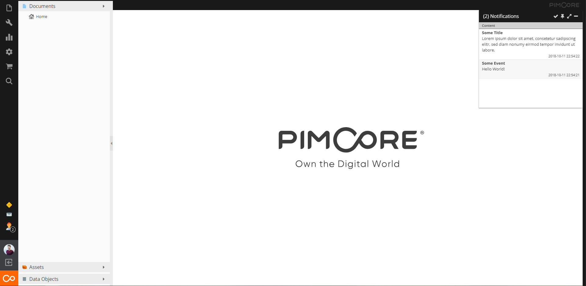

# Pimcore Ignite

Ignite your customer's user experience by adding web realtime functionalities to your web application. [Read more about the Realtime Web](Docs/realtime.md).

> The bundle was not tested in production yet and is still considered as alpha version.

## Functional overview:

- Channel system for managing arbitrary events within your application.
- Three types of channels
    - _private_: authentication required
    - _presence_: authentication required, user information is stored & automatic join/leave events
    - _public_: everyone can join and send events
- Channels can be assigned one or more transport services called _Drivers_
    - _Pusher_: realtime events via a websocket connection [See Pusher documentation for details](https://pusher.com/docs)
    - _Logger_: logged events in pimcore application logger
    - _Notification_: persisted events with assigned data for user notifications
- Client-side code generation for connection establishment and channel subscriptions for specific drivers.
- Show online users and notifications in Pimcore admin interface, activatable via separate user permissions

## Components

| Component | Description | Example |
|:-------------|:------------- |:------------- |
| Channels | There are 3 types of channels: public, private and presence. | global, user, product, ... |
| Drivers | Drivers define the possible transport layers for the pub/sub functionality.    | Logger, Pusher, Notification |
| Authenticators | Private and presence channels need authentication, authenticator provide an interface for it. | Firewall specific user authentication i.e. `/admin`, `/app`, ... |
| Radio | Manages all application channels. |  |

## Getting started
- [Installation](./docs/Installation.md)
- [Configuration](./docs/Configuration.md)
- [Code Samples](./docs/Codesamples.md)

## Impression

In the upper right corner there is the notification widget, which can be enabled via a user permission. 
The widget can be collapsed, repositioned via draggging and resized. 
By clicking a notification item it gets marked as `read` and is removed from the list.

In the lower left corner there is the user persence icon, which shows which users are online by hovering or clicking on the user icon.

